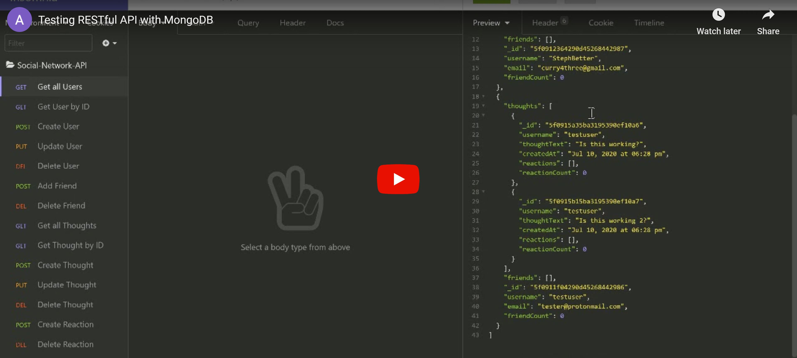

# Social-Network-API 

## Description
This is a RESTful API created to emulate the functions of a social network. It is created using MongoDB for a NoSQL design.

## Table of Contents
* [Installation](#Installation)
  
* [Usage](#Usage)

* [License](#License)

* [Questions](#Questions)

## Installation
Installation instructions listed below:
```
npm init -y
npm install
```
  
## Usage
MongoDB is required to use this application. Use an application such as Insomnia Core or Postman to easily test your requests.

```
mongod
npm start
```

[](https://www.youtube.com/embed/4n2HNyEJADk)

## License
A short and simple permissive license with conditions only requiring preservation of copyright and license notices. Licensed works, modifications, and larger works may be distributed under different terms and without source code.

To view the full license, [click here](./src/license/MIT.txt).

## Questions
If you have any questions, you can find me at [aelisker](https://github.com/aelisker) and via email at [alisker@protonmail.com](mailto:alisker@protonmail.com).
    